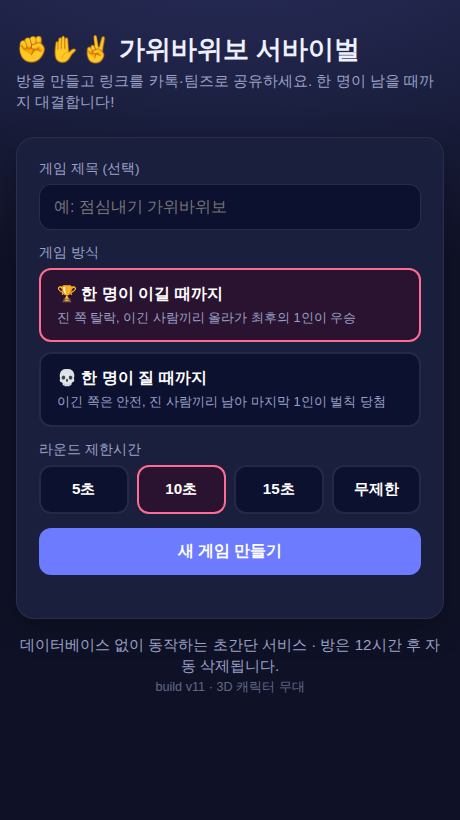
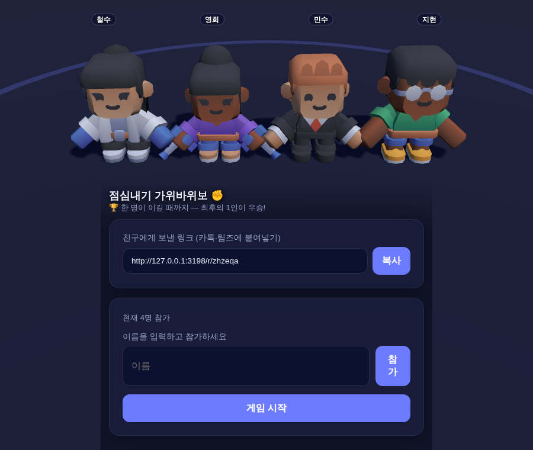
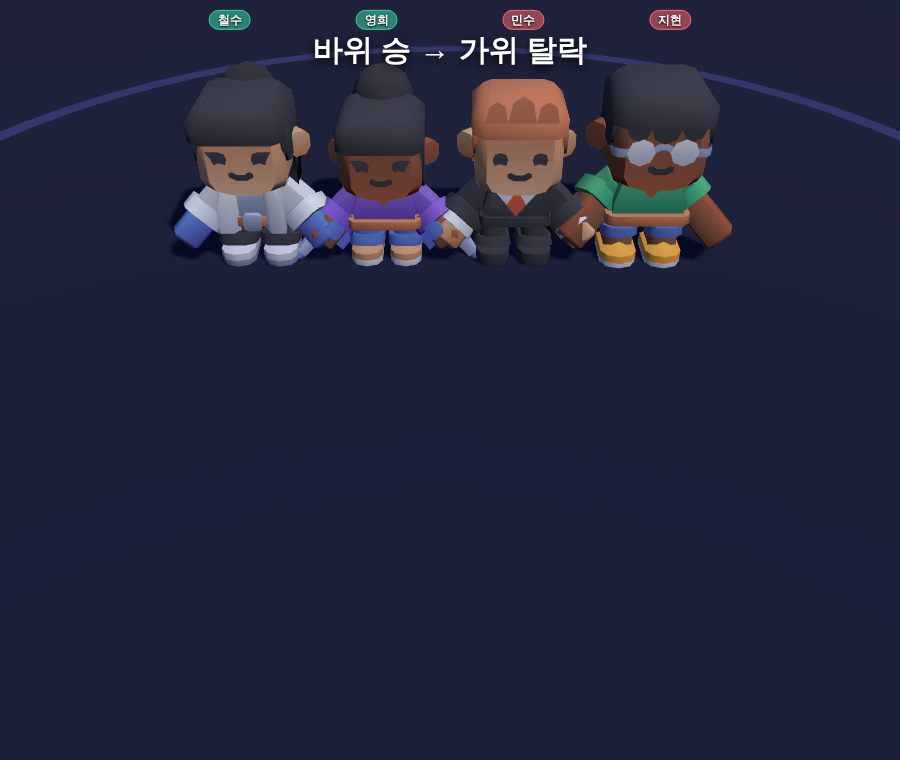

# ✊✋✌️ 가위바위보 서바이벌

링크를 카톡·팀즈로 공유하면, 여러 명이 각자 가위바위보를 내고 **한 명이 남을 때까지** 대결하는 초간단 온라인 가위바위보입니다.

## 스크린샷

| 게임 만들기 | 로비 (3D 캐릭터) | 결과 공개 |
|:---:|:---:|:---:|
|  |  |  |
| 방식·제한시간 선택 | 닉네임 단 캐릭터가 모여 대기 | 모여서 ✊✋✌️ → 승/패 연출 |

## 무료 배포 (Render)

[](https://render.com/deploy?repo=https://github.com/jungrok5/rps-online/tree/main)

위 버튼 → Render 로그인 → **Apply** 한 번이면 배포됩니다. `render.yaml`에
빌드/시작 명령이 정의돼 있어 추가 설정이 필요 없습니다. 배포 후
`https://rps-online-xxxx.onrender.com` 주소로 방을 만들어 링크를 공유하세요.

> 무료(Free) 인스턴스는 15분간 접속이 없으면 잠들고, 첫 접속 시 약 30초
> 콜드스타트가 있습니다. 게임 중에는 폴링으로 계속 깨어 있어 문제없습니다.

- **데이터베이스 없음** — 모든 상태는 서버 메모리에 저장됩니다(재시작 시 초기화).
- **의존성 없음** — Node 내장 모듈만 사용. `node server.js` 하나로 실행.
- **실시간 갱신** — WebSocket 없이 클라이언트 폴링(1.5초)으로 처리.

## 실행

```bash
node server.js
# http://localhost:3000
```

포트 변경: `PORT=8080 node server.js`

## 테스트

```bash
npm test         # 판정 로직 단위 + HTTP 통합 테스트 (의존성 없음, Node 18+ 전역 fetch)
```

3D 무대 스모크(스크린샷 캡처)는 Playwright가 필요합니다(선택):

```bash
npm i playwright
PLAYWRIGHT_BROWSERS_PATH=/opt/pw-browsers node test/smoke.mjs   # docs/*.png 생성
```

- `test/test.js` — 가위바위보 판정(승/패/무승부·last-winner/last-loser), 입력 검증,
  join 중복·랜덤 닉네임, start/play/reset, 라운드 경합 가드, 트래버설 가드 (단위 + 통합)
- `test/smoke.mjs` — 실제 Chromium으로 3D 연출을 띄워 콘솔 에러 0 + 스크린샷 (브라우저 E2E)

## 게임 방식 (서바이벌)

1. **새 게임 만들기** → 짧은 방 링크 생성 (`/r/xxxxxx`)
2. 링크를 카톡·팀즈에 공유 → 참가자들이 이름 입력 후 참가
3. 방장이 **게임 시작** (2명 이상)
4. 매 라운드 생존자 전원이 가위/바위/보 선택
   - **두 종류만 나오면** → 이긴 쪽이 올라가고 진 쪽 탈락 (이긴 사람끼리 다음 라운드)
   - **모두 같거나 세 종류 다 나오면** → 무승부, 같은 인원으로 재대결
5. **최후의 1인** 이 남으면 🏆 우승

### 추가 기능
- **3D 캐릭터 무대**: 참가하면 Kenney Mini Characters 중 하나가 랜덤 배정돼 머리 위 닉네임과 함께 등장. 다 제출하면 가운데로 모여 "두구두구" 후 ✊✋✌️를 내고, 승자는 만세·패자는 좌절 애니메이션. (Three.js + WebGL, 미지원 시 2D 연출로 자동 폴백)
- **게임 방식 선택**: 한 명이 이길 때까지(최후의 승자) / 한 명이 질 때까지(벌칙 당첨)
- **라운드 제한시간**: 5·10·15초 또는 무제한. 시간 내 미선택 시 자동 랜덤 제출(서버가 강제)
- **🎲 랜덤으로 내기** 버튼
- **2D 폴백 연출**: WebGL이 없을 땐 룰렛식 슬롯머신으로 결과 공개

### 에셋 / 라이선스
- 3D 캐릭터: [Kenney Mini Characters](https://kenney.nl/assets/mini-characters) (CC0)
- 3D 엔진: [Three.js](https://threejs.org) (MIT) — `public/vendor/`에 동봉
- 모두 `public/`에 동봉되어 외부 CDN 의존 없이 동작합니다.

## 구조

```
server.js          순수 Node HTTP 서버 (API + 정적 파일 + 게임 로직)
public/index.html  방 생성 페이지
public/room.html   로비·대결·결과 (폴링 SPA)
public/style.css   스타일
```

## 배포 메모

서버 메모리 저장 방식이라 **항상 켜져 있는 단일 인스턴스**에 배포해야 합니다
(Render / Railway / Fly.io 등). 서버리스(Vercel 등)에 올리려면 메모리 대신
관리형 KV(Upstash 등)로 저장소만 교체하면 됩니다.
